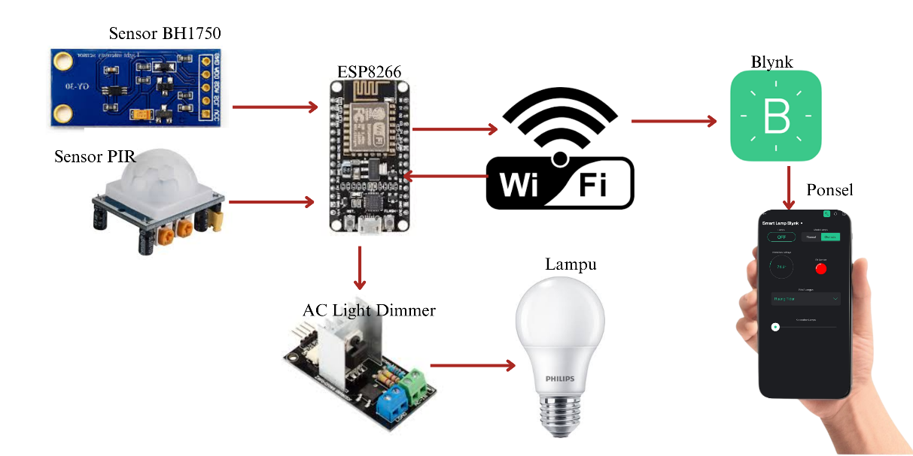

IoT Smartlamp with Blynk
Proyek ini merupakan Sistem otomatisasi lampu berbasis IoT menggunakan ESP8266, sensor BH1750, sensor PIR, dan AC Light Dimmer. Dikendalikan dari aplikasi Blynk, sistem ini dirancang untuk mendukung efisiensi energi dan meningkatkan kenyamanan pengguna dalam berbagai kondisi pencahayaan.

## Fitur Utama
- Deteksi pergerakan manusia menggunakan sensor PIR.
- Pengukuran intensitas cahaya alami dengan sensor BH1750.
- Pengaturan kecerahan lampu otomatis sesuai kebutuhan ruangan.
- Mode Manual dan Otomatis bisa diatur melalui aplikasi Blynk.
- Pemantauan dan pengontrolan jarak jauh via smartphone.

## Komponen yang Digunakan
- ESP8266 NodeMCU
- Sensor PIR (Passive Infrared)
- Sensor BH1750 (Light Intensity Sensor)
- AC Light Dimmer Module
- Lampu AC
- Aplikasi Blynk

## Cara Kerja Singkat
1. Sensor PIR mendeteksi keberadaan manusia.
2. Sensor BH1750 mengukur tingkat pencahayaan ruangan.
3. Sistem menentukan apakah lampu perlu dinyalakan atau dimatikan, dan berapa tingkat kecerahannya.
4. Pengguna dapat memilih mode Manual atau Otomatis melalui aplikasi Blynk.
5. Data status dikirim ke Blynk untuk dipantau secara real-time.

## Instalasi
1. Clone repository:
    ```bash
    git clone https://github.com/antikadianliku/iot-smartlamp-blynk.git
    ```
2. Upload kode ke ESP8266 menggunakan Arduino IDE.
3. Hubungkan perangkat keras sesuai diagram rangkaian.
4. Konfigurasikan aplikasi Blynk:
   -Masukkan Auth Token
   -Atur pin virtual sesuai dengan kode
📌 Pastikan semua library yang dibutuhkan telah terinstal di Arduino IDE (seperti Blynk, BH1750, ESP8266WiFi, dll).

  
## License
MIT License — silakan gunakan, ubah, dan kembangkan untuk kebutuhan edukasi dan penelitian.


---

## Arsitekstur Sistem


## Tampilan Blynk
<img src="Images/Antarmuka.png" width="500" /

## Skematik Sistem
<img src="Images/Skematik.png" width="500" /

